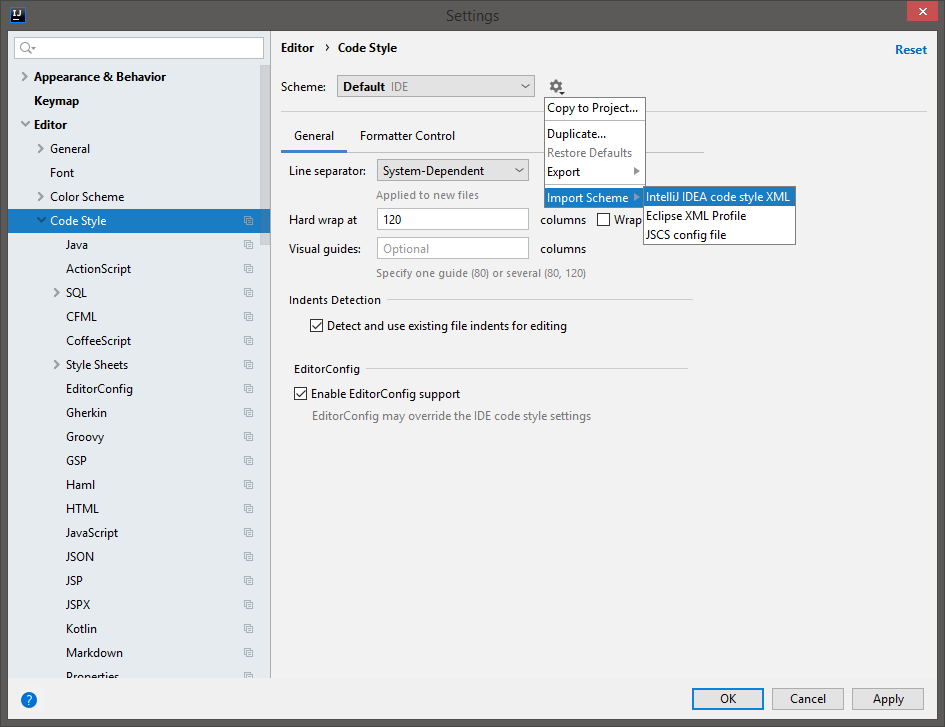

Contributing to WebLaF
---

First off, thanks for taking the time to read this and potentially contribute to WebLaF project!

This document contains a set of guidelines that you might find useful for contributing to WebLaF project. Those are just guidelines, not rules. Use your best judgment and feel free to propose changes to this document if you feel that something can be improved.

Issues
---

The easiest way to contribute to WebLaF project is opening a [new issue](https://github.com/mgarin/weblaf/issues/new) for reporting a bug or suggesting a feature, improvement or a new wiki article.
 
 I am developing this project mostly alone and I try to keep releases as polished as they can be, but bugs are unavoidable and the sooner I know about them - the sooner I can deliver a fix. 
 
 Any improvement or feature suggestions are just as I do want to expand WebLaF functionality as much as possible and make it as user-friendly as possible.

#### Bug report

If you found a bug and want to [report it](https://github.com/mgarin/weblaf/issues/new) - next few things are crucial for me to know:

- **WebLaF version** you found it in
- **JDK version** you are using to reproduce the bug
- **OS type & version** you are running your application on

Also if bug cannot be reproduced in demo app or on a basic component - please provide a [SSCCE](http://sscce.org/) that can be used to reproduce it. The harder it is for me to reproduce - the longer it will take to fix.

#### Feature suggestion

Something is missing in WebLaF and you would like to see it added? - feel free to [open an issue](https://github.com/mgarin/weblaf/issues/new)! And make sure to describe feature you would like to see added as much is possible.

If it is a new component request -

- What exactly is it and how should it work?
- Any analog examples from other applications? (doens't really need to be a Java app)
- Anything specific you would like to be added to it?
- Any particular ideas about the visual style?

If it is a new code feature -

- What exactly is it and how should it work?
- Are there any working implementations of that feature that you know of?
- If yes, is it worth being added instead of using a 3rd-party library?
- If yes, should it have it's own module or it's a small thing?

These questions should help you to shape your general idea you have into a more detailed issue request. 

#### Improvement suggestion

You found some tangled code, some weirdly behaving component or something else that you know how to improve? - feel free to [open an issue](https://github.com/mgarin/weblaf/issues/new)!

If you want to suggest a behavior/view change - simply describe how you see it and we will discuss it.

If you want to suggest a code change - you can check Pull Requests section below.

#### Wiki article suggestion

If you want to ask for a new wiki aricle:

- Did you already check [available wiki articles](https://github.com/mgarin/weblaf/wiki)?
- Did you check [previously answered questions](https://github.com/mgarin/weblaf/issues?q=label%3Aquestion+is%3Aclosed)?
- What functionality you want to see covered in it?

If what you're looking haven't been mentioned/described yet - [open an issue](https://github.com/mgarin/weblaf/issues/new).

If you would like to write a wiki article:

- Be clear about what feature you are describing and what use cases it has
- Make sure to separate article into clear sections if it is large
- Make sure to provide code examples and screenshots if necessary
- Use [GitHub markdown](https://guides.github.com/features/mastering-markdown/) for the article content 
- Specify which WebLaF version this article is written for & modules necessary

Once you're done writing it - you can [open an issue](https://github.com/mgarin/weblaf/issues/new) with the article content. I will review it, make adjustments if necessary and will post it in the [project wiki](https://github.com/mgarin/weblaf/wiki).

Pull Requests
---

Before writing any code please first discuss the changes you wish to make via [issue](https://github.com/mgarin/weblaf/issues/new), [email](mailto:mgarin@alee.com), or [Gitter](https://gitter.im/mgarin/weblaf) with me (Mikle).

Thing is - Swing is simple and at the same time it's not. There are a lot of caveats both in Swing and WebLaF code and there are reasons why some things are made the way they are. Those reasons are not obvious sometimes. I appreciate the time you want to put into the project and don't want it to go to waste. So it is always best to discuss the changes you want to make first, especially considering they might already be in the project plan or even in development.

There are also a few other things you might want to know before writing any additions or improvements for WebLaF.

#### Code Philosophy

There are a few guidelines I'm trying to follow when writing WebLaF code, some I've "adopted" pretty early on while some other ones I've started following quite late, so library code is certainly not completely streamlined, but I'm working on it.

Note that these are just some basic things, but they can still heavily affect the resulting code and it's quality, so I strongly recommend checking this list:

- **Follow [Java naming convetions](https://www.oracle.com/technetwork/java/codeconventions-135099.html)** That certainly helps keeping code more clean, streamlined and simply makes it more readable for other Java developers involved in the project. If you aren't sure how something should be named - feel free to ask! 

- **Use [fail-fast](https://en.wikipedia.org/wiki/Fail-fast) approach** Do not try to sweep any critical exceptions under the rug. Fail-fast approach helps finding any potential issues early on and keep the code cleaner overall. Any exceptions you can't handle on the spot? - let them loose. There is not much point in ignoring exceptions that will cause UI to halt anyway - it will only make debugging the problem harder.

- **Don't forget about [Event Dispatch Thread](https://github.com/mgarin/weblaf/wiki/Event-Dispatch-Thread)** All UI-related operations should be performed on EDT, no exceptions. That does limit performance, but that also allows you to simplify the code a lot since you can be sure that all UI-related operations are performed on the same thread and should never intersect. Such assumptions are made all across the Swing code and also present in WebLaF code.

- **Avoid unnecessary getters and setters** Don't return more information from any `class` than necessary to use it. Even better solution - hide instance class completely behind an `interface` and provide any public APIs in that interface. Otherwise "everyone" end up having access to "everything" and it is really bad from a design standpoint. It is a bit different for `Component` classes because they need to provide getters and setters for all component settings, but that is more of an exception.

- **Always use single exit point for methods** Some methods will get bigger, but it shouldn't matter. Those will still be a lot easier to read than a mess with 10+ return statements and twisted logic behind it. More return statements you have in your method - higher the chance that you or someone else will make a logical error trying to modify that method later on. This includes both - methods that have return value and `void`  methods.

- **Use final for fields, parameters and variables that can be final** It makes code a lot easier to read and understand when you don't have a million mutable fields. A good example: if your method must return something - create a final local variable at the start and assign value to it once in every possible conditional branch of the code, then return that variable once at the very end of the method.

- **Avoid `null`s whenever possible** Obviously we're talking about Swing and there are countless cases where `null`s are used as default values and whatnot, so it is impossible to avoid `null`s completely. But whenever I'm writing a new code piece or a feature - I make it `null` friendly only when it is really necessary, otherwise I keep it `null`-less.

- **Use `@NotNull` and `@Nullable` annotations** These annotations will make method and field use-cases clear and should also help you to decide when `null`s are actually needed for the code itself and when they aren't. And as mentioned before - the less `null`s code uses - the better.

- **Write JavaDoc for all parts of code** Even if something is obvious - still write JavaDoc for it, expand it later if necessary. Other developers might not find it obvious and will thank you later for leaving the life-saving notes.

- **Write comments only when needed** Unlike JavaDoc comments will only be visible to people working with source code and are usually only useful for large methods or constructors, but in that case it's usually better to split your code into smaller methods or classes instead and simply have JavaDoc for those. There are some exceptions though: comments about some possible bugs, references to bugs on tracker, todos or comments about some extremely convoluted pieces of code.  

Some of these things can be handled by modern IDEs, like final marker, annotations or single exit point methods. IDE can also assist you with formatting your code, writing JavaDoc and checking sanity of the code overall.

There are also some things I haven't tried on the project yet due to some difficulties but might try in the future, so these guidelines will certainly be updated.

#### Code Formatting

I'm writing WebLaF using [IntelliJ IDEA IDE](https://www.jetbrains.com/idea/) and generally recommend using it due to multiple awesome features it has. Latest code style and inspection settings for IntelliJ IDEA IDE are available in project sources: 
https://github.com/mgarin/weblaf/tree/master/ide

You can specify them instead of the default settings in main settings dialog:

Code style (`ide/intellij-idea-code-style.xml`) 

Code style (`ide/intellij-idea-inspections.xml`) 

Once these are set you will be able to safely reformat (`Ctrl+Alt+L` by default) any project file and you should also get some warnings for the stuff mentioned in Code Philosophy section.