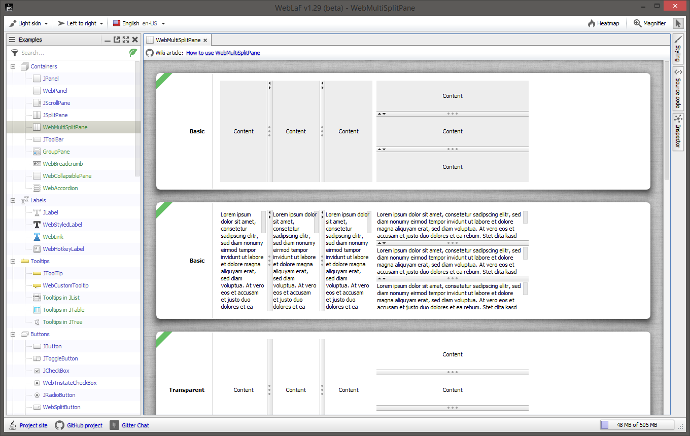
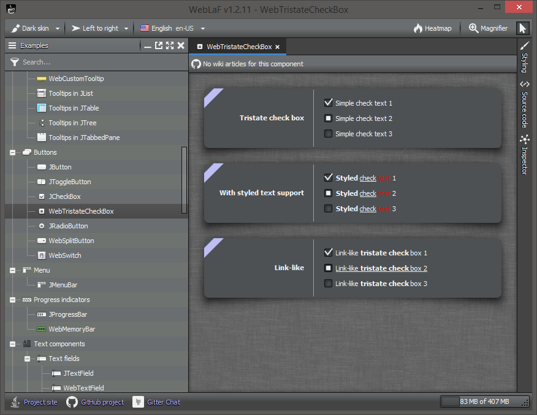

About
----------
[](https://github.com/mgarin/weblaf/releases)
[](https://search.maven.org/search?q=g:com.weblookandfeel)
[](https://github.com/mgarin/weblaf)
[](https://github.com/mgarin/weblaf/blob/master/LICENSE.txt)
[](https://github.com/mgarin/weblaf/commits/master)
[](https://gitter.im/mgarin/weblaf)

**WebLaf** is a fully open-source Look and Feel and component library written in pure Java for cross-platform desktop Swing applications. But it is also more than just that - it was made with intention of covering pretty much all aspects of UI development and at this point WebLaF includes an extensive set of features that goes beyond just Look and Feel or Swing component library.

To look at some features provided by WebLaF I recommend checking out the demo -

[](https://github.com/mgarin/weblaf/releases/download/v1.2.13/weblaf-demo-1.2.13-jar-with-dependencies.jar)

[](https://github.com/mgarin/weblaf/releases/download/v1.2.13/weblaf-demo-1.2.13-jar-with-dependencies.jar)

It is an [executable JAR](https://github.com/mgarin/weblaf/releases/download/v1.2.13/weblaf-demo-1.2.13-jar-with-dependencies.jar) which you can run if you have JRE 6 or higher installed.

**Features**

- Fully reskinnable UI with a few predefined skins available out-of-the-box
- Wide range of popular custom components and features 
- Advanced versions of all basic Swing components
- RTL orientation support for basic Swing and custom components
- Multi-language support for all UI elements
- Advanced API for providing UI element tooltips
- Advanced API for saving and restoring UI element states
- Advanced API for assigning hotkeys to UI elements and actions 
- Countless utilities for convenient work with Swing APIs
- Application plugin support
- And more...

**WebLaF project**

- [Fully open-source without any hidden proprietary code](https://github.com/mgarin/weblaf)
- [Have been developed for 10+ years](https://github.com/mgarin/weblaf/releases)
- [Constantly growing and being improved](https://github.com/mgarin/weblaf/projects)
- [Open for any suggestions and improvements](https://github.com/mgarin/weblaf/blob/master/CONTRIBUTING.md)


Quick start
----------

**Including WebLaF in your project (Maven)**

If you are working with a Maven project you can simply add dependency for `weblaf-ui` module:
```xml
<dependency>
  <groupId>com.weblookandfeel</groupId>
  <artifactId>weblaf-ui</artifactId>
  <version>1.2.13</version>
</dependency>
```
You can also use `RELEASE` or `LATEST` version instead of specific one.

**Including WebLaF in your project (binaries)**

You can always find latest WebLaF binaries in [releases section](https://github.com/mgarin/weblaf/releases). These are the very same binaries that are available through Maven, simply copied over to release section for convenience. Don't forget to download all dependencies in this case as well, they are always linked at the end of release notes.

If you aren't sure which binaries to use or which dependencies you might be missing - I recommend reading [How to use WebLaF](https://github.com/mgarin/weblaf/wiki/How-to-use-WebLaF) wiki article - it gives a short explanation on what each module does and requires.

**Installing L&F**

You can install WebLaF by simply calling `WebLookAndFeel.install ()` or using one of standard Swing `UIManager` methods:
```java
public class QuickStart
{
    public static void main ( final String[] args )
    {
        // You should always work with UI inside Event Dispatch Thread (EDT)
        // That includes installing L&F, creating any Swing components etc.
        SwingUtilities.invokeLater ( new Runnable ()
        {
            @Override
            public void run ()
            {
                // Install WebLaF as application LaF
                WebLookAndFeel.install ();

                // You can also specify preferred skin right-away
                // WebLookAndFeel.install ( WebDarkSkin.class );

                // You can also do that in one of the old-fashioned ways
                // UIManager.setLookAndFeel ( new WebLookAndFeel () );
                // UIManager.setLookAndFeel ( "com.alee.laf.WebLookAndFeel" );
                // UIManager.setLookAndFeel ( WebLookAndFeel.class.getCanonicalName () );

                // You can also configure other WebLaF managers as you like now
                // StyleManager
                // SettingsManager
                // LanguageManager
                // ...

                // Initialize your application once you're done setting everything up  
                // JFrame frame = ...

                // You can also use Web* components to get access to some extended WebLaF features
                // WebFrame frame = ...
            }
        } );
    }
}
```
That's it, now your application is using WebLaF.

**Helpful articles**

If you are new to Swing I recommend reading official Oracle articles about it first:
- [Creating a GUI with JFC/Swing](https://docs.oracle.com/javase/tutorial/uiswing/index.html)

It is also important to understand how threading should be approached when working with Swing:
- [Event Dispatch Thread](https://github.com/mgarin/weblaf/wiki/Event-Dispatch-Thread)

And if are new to WebLaF - I recommend checkin out these wiki articles first:
- [How to use WebLaF](https://github.com/mgarin/weblaf/wiki/How-to-use-WebLaF)
- [Styling introduction](https://github.com/mgarin/weblaf/wiki/Styling-introduction) 

You can also check [other wiki articles](https://github.com/mgarin/weblaf/wiki) - there are quite a few available for different WebLaF components and features and they might save you a lot of time.

**Sources**

One last thing - I higly recommend having WebLaF sources attached to your IDE project. I'm doing my best to keep it clean and well-documented, so if you are wondering what some method does or how a feature works - peeking into the source code might be the easiest and fastest way to find out. 

All of WebLaF source code is fully disclosed and available here on GitHub. Source code for releases is available in [releases](https://github.com/mgarin/weblaf/releases) section and on [Maven](https://search.maven.org/search?q=g:com.weblookandfeel).


Dependencies
----------

Even though I'm trying to keep the minimal amount of dependencies on 3rd-party libraries - WebLaF has quite a few at this point, so it is worth explaining which dependencies are used for what.

First, here are direct library dependencies you may find across different WebLaF modules:

- [**Slf4j**](http://www.slf4j.org/) is one of the most commonly used logging tools and also offers nice options for bridging logging over to other popular tools, so this was the obvious choice. Originally I used older [log4j](https://logging.apache.org/log4j/) verson, but moved on from it due to some restrictions and nuances.

- [**XStream**](https://x-stream.github.io/) is used for serializing and deserializing objects to and from XML. `LanguageManager` uses it to read translation files. `SetingsManager` uses it to store and read various settings. `StyleManager` uses it to read skins and skin extensions. `IconManager` uses it to read icon sets. `PluginManager` uses it to read plugin descriptors found in plugin JAR file. It is also used for variety of smaller features across WebLaF library.

- [**SVG Salamander**](https://svgsalamander.java.net/) is a standalone library providing loading, modification and rendering capabilities for SVG icons. Unlike [Apache Batik](https://xmlgraphics.apache.org/batik/) it is way more lightweight and often able to render SVG icons slightly faster. It does have a few issues and I plan to make an abstract API for SVG icons support to allow choice between SVG Salamander and Apache Batkin in the future as explained in [#337](https://github.com/mgarin/weblaf/issues/337). It is also important to note that currently I'm using my own release of [SVG Salamander fork](https://github.com/mgarin/svgSalamander) that contains latest changes from original project and some minor non-API-breaking improvements added on top of it.

- [**Java Image Scaling**](https://github.com/mortennobel/java-image-scaling/) is a lightweight library used in `ImageUtils` exclusively for better downscaling of raster images in runtime.

- [**Jericho HTML parser**](http://jericho.htmlparser.net/) is used in `HtmlUtils` for rendering HTML into plain text. It is also used for quick tag lookup in `StyleEditor`. Potentially I might move this dependency as well as `StyleEditor` into a separate module(s) as described in [#336](https://github.com/mgarin/weblaf/issues/336).

- [**RSyntaxTextArea**](http://bobbylight.github.io/RSyntaxTextArea/) is used for providing a styleable text area supporting syntax highlighting for multple programming languages. It is also used in `DemoApplication` for styles and code preview and in `StyleEditor` for style preview and editing. 

There are also a few code pieces borrowed from other open-source projects:

- `TableLayout` implementation is based on [Clearthought](http://www.clearthought.info/) source code, but has some minor modifications and fixes added on top of it. 

- Various image filters and utilities found in `com.alee.graphics.filters` as well as strokes found in `com.alee.graphics.strokes` packages are based on [JH Labs](http://www.jhlabs.com/) examples, but slightly cleaned up and with a few minor improvements added.

- `Easing` interface implementations are based on [jQuery Easing Plugin](http://gsgd.co.uk/sandbox/jquery/easing/) source code, but ported to Java and adjusted to better fit into custom animation system implemeted in WebLaF.

- `IOUtils` implementation is based on [Apache Commons IO](https://commons.apache.org/proper/commons-io/) source code, but since it only uses a fraction of it's functionality I didn't want to include it as dependency.

- Classes backing `GifIcon` implementation were originally made available by Kevin Weiner at http://www.fmsware.com/stuff/gif.html, which states that the code "may be freely used for any purpose. Unisys patent restrictions may apply to the LZW portions". [Unisys and LZW patent enforcement](https://en.wikipedia.org/wiki/GIF#Unisys_and_LZW_patent_enforcement) for reference. Code logic was mostly untouched, but I did a refactoring pass and fixed a few possible minor issues.

Other non-code mentions:

- Raster icons are mostly coming from [Fugue](https://p.yusukekamiyamane.com/) icon set.

- SVG icons are mostly coming from [IconMoon](https://icomoon.io/) icon set.

It is also important to mention that all dependencies and borrowed code pieces are properly attributed within the library source code itself and within available binary distributions.


Java 9+
----------
Starting from Java 9 once you run an application with WebLaF you will most probably see next warning: 
```
WARNING: An illegal reflective access operation has occurred
WARNING: Illegal reflective access by com.alee.utils.ReflectUtils (file:weblaf-core-x.x.x.jar) to method {method.name}
WARNING: Please consider reporting this to the maintainers of com.alee.utils.ReflectUtils
WARNING: Use --illegal-access=warn to enable warnings of further illegal reflective access operations
WARNING: All illegal access operations will be denied in a future release
```
Or a similar one pointing at a different JAR or method.

This warning appears because WebLaF uses Reflection API a lot to access various private/proprietary Java features as it is nearly impossible to have a robust Look and Feel otherwise due to Swing limitations and some bad Sun/Oracle design decisions. Starting from Java 9 - such "unauthorized" access displays a warning like the one shown above. 

Also starting from Java 12 some of Reflection API features were made unavailable, but I already added a workaround for that which is available (and enabled by default) within release artifacts on both GitHub and Maven. This workaround uses new backward-compatible multi-release JAR feature to provide a separate code implementation for Java 12+ runtime.

Problem is - it is still impossible to fully "fix" these warnings from the library side. To avoid seeing them - your application must specify at launch which modules specifically should be accessible to other modules through Reflection API. If suchs permissions are not given or given incorrectly - you will keep encountering warnings (or even errors) from above pointing at "illegal" reflective access point.

Here is a list of JVM options that can be used with Java 9 and higher to avoid the warnings:
```
--add-opens java.base/java.util=ALL-UNNAMED
--add-opens java.base/java.text=ALL-UNNAMED
--add-opens java.base/java.lang.reflect=ALL-UNNAMED
--add-opens java.base/java.net=ALL-UNNAMED
--add-opens java.base/java.lang=ALL-UNNAMED
--add-opens java.base/jdk.internal.loader=ALL-UNNAMED
--add-opens java.desktop/javax.swing=ALL-UNNAMED
--add-opens java.desktop/javax.swing.text=ALL-UNNAMED
--add-opens java.desktop/java.awt.font=ALL-UNNAMED
--add-opens java.desktop/java.awt.geom=ALL-UNNAMED
--add-opens java.desktop/java.awt=ALL-UNNAMED
--add-opens java.desktop/java.beans=ALL-UNNAMED
--add-opens java.desktop/javax.swing.table=ALL-UNNAMED
--add-opens java.desktop/com.sun.awt=ALL-UNNAMED
--add-opens java.desktop/sun.awt=ALL-UNNAMED
--add-opens java.desktop/sun.swing=ALL-UNNAMED
--add-opens java.desktop/sun.font=ALL-UNNAMED
--add-opens java.desktop/javax.swing.plaf.basic=ALL-UNNAMED
--add-opens java.desktop/javax.swing.plaf.synth=ALL-UNNAMED
--add-opens java.desktop/com.sun.java.swing.plaf.windows=ALL-UNNAMED
--add-opens java.desktop/com.sun.java.swing.plaf.gtk=ALL-UNNAMED
--add-opens java.desktop/com.apple.laf=ALL-UNNAMED
```
This should hide the "illegal reflective access" warnings, but you most probably will see new ones instead: 
```
WARNING: package com.sun.java.swing.plaf.gtk not in java.desktop
WARNING: package com.apple.laf not in java.desktop
```
This happens because the list above is made for cross-platform use and includes all different modules accessed by WebLaF which you most probably won't ever have all at once. And JVM simply warns you in that case that some modules you're granting access to do not exist in your application.

These are the modules that are platform-related:
```
java.desktop/com.sun.java.swing.plaf.windows
java.desktop/com.sun.java.swing.plaf.gtk
java.desktop/com.apple.laf
```
If you want to completely avoid any warnings - you will need to use a platform-related list of JVM options for your application, basically excluding some of these three.

Also note that some new warnings might appear at some point if you would be accessing your custom components through the styling system because it uses Reflection API to access fields and methods in various classes it uses, including any custom ones. You can block any illegal reflection access to make those cases visible faster by adding next JVM option:
```
--illegal-access=deny
```
This will force JVM to throw an exception whenever Reflection API is used illegally anywhere with a full stack trace that can be used to track down the source and add aother JVM option for the module access.

If you would find any JVM modules that I've missed in the list above - I would appreciate if you can post an issue here or contact me directly so I could update the information for other WebLaF users.


Licensing
----------

WebLaF is available under GPLv3 license for any non-commercial open-source projects. Commercial license is available as an alternative option and intended for closed-source and/or commercial projects. It removes restrictions dictated by GPLv3 license and can either be used for a single or any amounts of projects, depending on the commercial license sub-type.

Here is a summary of different available WebLaF licenses: 

1. **GPLv3 license [ [weblaf-gpl.txt](licenses/weblaf-gpl.txt) ]**

    - Unlimited amount of non-commercial open-source projects
    - Unlimited amount of developers working with your non-commercial open-source projects
    - Unlimited amount of end-user distributions of your non-commercial open-source projects 
    - Full access to complete library [source code](https://github.com/mgarin/weblaf)
    - Free [updates](https://github.com/mgarin/weblaf/releases) to all newer minor and major versions
    - Free support via [GitHub](https://github.com/mgarin/weblaf/issues), [Gitter](https://gitter.im/mgarin/weblaf) and [e-mail](mailto:mgarin@alee.com)
    
    Limitations:
    
    - Cannot use in any commercial projects
    - Cannot create any commercial derivative projects

2. **[Single-application commercial license](http://weblookandfeel.com/buy/) [ [weblaf-commercial.txt](licenses/weblaf-commercial.txt) ]**

    - Single commercial closed-source project
    - Unlimited amount of developers working with your commercial project
    - Unlimited amount of end-user distributions of your commercial project
    - Full access to complete library [source code](https://github.com/mgarin/weblaf)
    - Free [updates](https://github.com/mgarin/weblaf/releases) to all newer minor and major versions
    - Prioritized support via [GitHub](https://github.com/mgarin/weblaf/issues), [Gitter](https://gitter.im/mgarin/weblaf) and [e-mail](mailto:mgarin@alee.com)
    
    Limitations:
    
    - Can only be used in one of your commercial closed-source project
    - Cannot create any commercial derivative L&F libraries

3. **[Multi-application commercial license](http://weblookandfeel.com/buy/) [ [weblaf-commercial.txt](licenses/weblaf-commercial.txt) ]**

    - Unlimited amount of commercial closed-source projects
    - Unlimited amount of developers working with your commercial project(s)
    - Unlimited amount of end-user distributions of your commercial project(s)
    - Full access to complete library [source code](https://github.com/mgarin/weblaf)
    - Free [updates](https://github.com/mgarin/weblaf/releases) to all newer minor and major versions
    - Prioritized support via [GitHub](https://github.com/mgarin/weblaf/issues), [Gitter](https://gitter.im/mgarin/weblaf) and [e-mail](mailto:mgarin@alee.com)
    
    Limitations:
    
    - Cannot create any commercial derivative L&F libraries
    
Commercial license can be purchased from the [WebLaF site](http://weblookandfeel.com/buy/). You can also contact me directly [through e-mail](mailto:mgarin@alee.com) for other payment options.


Development
----------
Back in 2011 I was the only one working on the project, it was quite rudimentary and wasn't really used in any real-life projects, but since then project has grown, received multiple updates, major improvements and reworks and is now used by multiple users and organizations. 

We are also using WebLaF as our main framework for all our desktop applications in Alee Software and are actively working on improving and adding new features to it. This might not be much, but you can take is a guarantee that project won't suddenly close or die out. One more thing I can add is that I personally plan to work on this project for as long as Oracle supports Swing in their new Java releases as I still consider it to be a superior UI framework compared to any other Java or non-Java UI frameworks, even considering all it's flaws and issues.

Those who are following the project might have noticed that pacing of updates have changed dramatically over last year. There are considerably more updates now and they are coming out at a more predictable rate - roughly every 1-2 months, depending on amount of features and changes. This partially happened because I finally finished the huge styling update that I've been working on for the last 3-4 years in background and that stopped me from delivering any changes for the time. Releasing that update allowed me to finally get new stuff rolling out, fix the library versioning, get WebLaF releases to Maven and do a lot of internal improvements to the library that I've wanted to do for a long while. I'm nowhere near being done though and you can expect new features and long-awaited improvements in the future!

Now, I must be honest here - WebLaF is not the only project I am working on and I do have quite busy periods from time to time where I can't get a lot of new stuff out (and it was one of the big reasons that styling update took years to release), but I am going to dedicate to consistent releases that have already been going on for a while. It's not all about new features - bugfixes and polish is just as important, and it is usually much easier and faster to do (except for you, JDK bugs) - that is something that will keep on coming even during the busy periods.

If you are interested in what's coming - I recommend taking a look at the [projects page](https://github.com/mgarin/weblaf/projects). I keep it up-to-date so you can easily see what I am working on right now and what is planned for the upcoming updates. That being said - features might get delayed or even moved to later updates in case they don't fit into 1-2 months release cycle, so don't take this as granted, but I will do my best to stick to the plan.

Planned release dates can be found on [milestones page](https://github.com/mgarin/weblaf/milestones), but just like the projects - dont take it as granted. They should be more accurate now that I have shorter release cycle, but I will still delay the update if it is necessary or might as well release it earlier if it is ready.


Feedback
----------

If have any questions, found some bugs or want to propose some improvements, you can:

- **[Open an issue](https://github.com/mgarin/weblaf/issues) here on GitHub**<br>
  I highly recommend this option for any bugs or feature requests

- **Chat with me and other WebLaF users [on Gitter](https://gitter.im/mgarin/weblaf)**<br>
  This option is best for any questions you want to ask and receive answer as fast as possible

- **Contact me directly at [mgarin@alee.com](mailto:mgarin@alee.com)**<br>
  This might be convenient if you want to discuss some issue or ask questions privately 